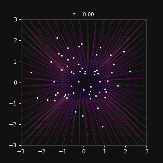
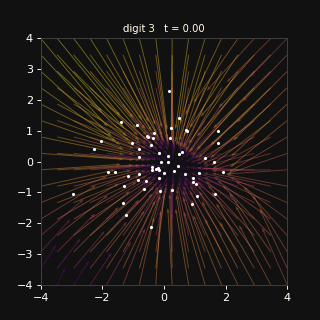

# Flow Matching Visualizer

A minimal, interactive toy that trains a small MLP to learn a **velocity field** that transports 2D Gaussian noise toward a target distribution — then lets you watch it work in real time.

Built as a focused learning project to understand the mechanics of [flow matching](https://arxiv.org/abs/2210.02747) before working on generative model infrastructure.

---

## What is flow matching?

Flow matching is a simulation-free method for training continuous normalizing flows. Instead of simulating an ODE during training, it directly regresses a neural network onto a known vector field that transports samples from a source distribution to a target.

### The math in three lines

Given a source sample **x₀ ~ N(0, I)** and a target sample **x₁ ~ p_data**, define a straight-line path:

```
x(t) = (1 − t)·x₀  +  t·x₁       t ∈ [0, 1]
```

The velocity along this path is constant:

```
dx/dt = x₁ − x₀
```

We train a neural network **v_θ(x, t)** to match this velocity at arbitrary (x, t) pairs:

```
L(θ) = E[ ‖ v_θ(x_t, t) − (x₁ − x₀) ‖² ]
```

At inference time, integrating **dx/dt = v_θ(x, t)** from t = 0 to t = 1 transports a noise sample to the learned target distribution.

---

## Features

### Tab 1 — Toy 2D distributions

- Train a `VelocityMLP` on three 2D target distributions with a live loss curve
- Scrub a time slider to watch the learned velocity field reorganize from t = 0 → 1
- Animate particles flowing through the field with fading trails, exported as a GIF
- Side-by-side Euler vs. RK4 solver comparison at low step counts (RK4 is ~34× more accurate at 15 steps)



### Tab 2 — MNIST latent flow matching

- Train a **convolutional VAE** with a 2D bottleneck on MNIST — the entire digit dataset collapses into a 2D latent space where classes cluster by digit
- Train a **class-conditioned velocity field** in that latent space: `v_θ(x, t, c)` where `c` is a digit embedding
- Switch the class selector (0–9) to reorganize the velocity field live
- **Decoded output panel**: integrates particles in latent space and decodes their final positions back to 28×28 pixel images using the VAE decoder

The key design decision is working in **2D latent space rather than pixel space** — this keeps the velocity field visualization exact (not PCA-approximated) while still producing real digit images.



---

## Project structure

```
src/
  data.py          — source (Gaussian) + toy target samplers + MNIST latent sampler factory
  interpolation.py — linear interpolant, target velocity, MSE loss
  model.py         — VelocityMLP: optional class conditioning via learned embedding
  train.py         — Adam training loop; supports toy targets and MNIST latent flow
  solvers.py       — Euler and RK4 ODE integrators, grid velocity helper
  vae.py           — Conv VAE (encoder/decoder), train_vae(), load_vae()
  visualize.py     — quiver + particle trails, decoded digit panel, GIF export
app.py             — Gradio UI: two tabs (toy distributions / MNIST latent flow)
scripts/
  train_vae.py     — standalone VAE pre-training script → checkpoints/vae.pt
  eyeball_latent.py — scatter-plot of 2D MNIST latent space coloured by class
tests/             — per-module unit tests (shape, finite, gradient flow)
```

---

## Supported target distributions (Tab 1)

| Key | Description |
|---|---|
| `two_moons` | Two interlocking crescents |
| `gaussian_mixture` | 8 Gaussian modes on a circle |
| `checkerboard` | 4×4 alternating squares in [−2, 2]² |

---

## Quick start

```bash
pip install -r requirements.txt
python app.py          # launches Gradio UI at http://localhost:7860
```

### Pre-train the VAE (optional — Tab 2 can also train it in-app)

```bash
python scripts/train_vae.py        # ~2 min on CPU, saves checkpoints/vae.pt
python scripts/eyeball_latent.py   # saves outputs/latent_space.png
```

### Command-line usage

```bash
# Toy flow matching
python -c "
from src.train import train
from src.solvers import euler_integrate
from src.data import sample_source
import torch

torch.manual_seed(0)
model, loss = train('two_moons', steps=5000)
x0 = sample_source(500)
traj = euler_integrate(model, x0)
print('final positions shape:', traj[-1].shape)
"

# Class-conditioned MNIST flow
python -c "
from src.vae import load_vae
from src.data import make_mnist_class_sampler
from src.train import train
from src.data import sample_source
from src.solvers import euler_integrate

vae = load_vae()                             # loads checkpoints/vae.pt
sampler = make_mnist_class_sampler(vae, digit=3)
model, _ = train(class_label=3, mnist_sampler=sampler, steps=3000)
x0 = sample_source(100)
traj = euler_integrate(model, x0)
print('latent endpoint shape:', traj[-1].shape)  # [100, 2]
"
```

### Run all tests

```bash
python tests/test_interpolation.py
python tests/test_model.py
python tests/test_train.py
python tests/test_solvers.py
python tests/test_vae.py
```

---

## Stack

- **PyTorch** — model, training, tensor ops (CPU-only, no GPU required)
- **torchvision** — MNIST dataset download and transforms
- **torchdiffeq** — reference ODE solver for comparison
- **Matplotlib** — `FuncAnimation` for the layered quiver + particle visualization
- **Gradio** — interactive two-tab UI
- **imageio / pillow** — GIF export
